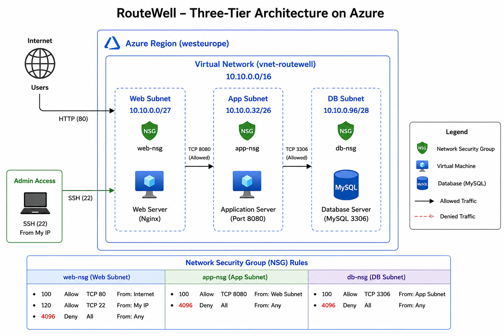

# routewell-multitier-vnet
My project capstone for Techcrush cohort7

# RouteWell Multi-Tier Azure Virtual Network


## Overview

This project implements a secure **multi-tier Azure Virtual Network architecture** for **RouteWell**, a regional logistics company migrating its dispatch application to Microsoft Azure.

The solution demonstrates Azure networking fundamentals including subnet segmentation, Network Security Groups (NSGs), least-privilege access control, and secure public access design.

The infrastructure was designed as part of the TechCrush Cohort 7 DevOps Capstone Project.

---

# Architecture



---

## Client Scenario

RouteWell is migrating its dispatch platform to Azure.

The application consists of three logical tiers:

- Web Tier
- Application Tier
- Database Tier

The company requires:

- Network isolation
- Secure communication between tiers
- Internet access only to the web application
- Protection of backend services
- Scalable IP addressing
- Least-privilege network security

---

# Solution Overview

The deployed architecture consists of:

- One Azure Resource Group
- One Virtual Network
- Three isolated subnets
- Three Network Security Groups
- Controlled communication between application tiers
- Secure public access only to the Web tier

---

# Network Topology

```
                 Internet
                     │
             Public IP Address
                     │
              Web Subnet (/27)
                     │
               Port 8080 Only
                     │
              App Subnet (/26)
                     │
               PostgreSQL
                     │
             Database Subnet (/28)
```

---

# Address Space

| Resource | CIDR |
|----------|------|
| VNet | 10.10.0.0/16 |
| Web | 10.10.0.0/27 |
| App | 10.10.1.0/26 |
| Database | 10.10.2.0/28 |

---

# CIDR Planning

| Tier | Current Hosts | Future Hosts | Chosen CIDR | Reason |
|-------|--------------|--------------|-------------|--------|
| Web | 12 | 12 | /27 | Provides sufficient capacity while minimizing wasted addresses |
| App | 20 | 40 | /26 | Supports projected application growth |
| Database | 6 | 6 | /28 | Efficient allocation for a small database tier |

Azure reserves five IP addresses in every subnet, which was considered during subnet sizing.

---

# Security Design

The architecture follows the **Principle of Least Privilege**.

### Allowed Traffic

| Source | Destination | Port |
|---------|-------------|------|
| Internet | Web | 80,443 |
| Web | Application | 8080 |
| Application | Database | 5432 |
| Administrator | Web | 22 |

### Blocked Traffic

- Internet → Application
- Internet → Database
- Web → Database
- Unnecessary east-west traffic
- Direct database exposure

---

# Public Access Design

Only the **Web VM** receives a Public IP address.

The Application and Database tiers remain private.

Administrative access follows a jump-host model:

```
Administrator

↓

Web VM

↓

Application VM

↓

Database VM
```

This minimizes attack surface while maintaining secure administration.

---

# Repository Structure

```
routewell-multitier-vnet

├── docs
│   ├── architecture-diagram.png
│   ├── CIDR-justification.md
│   ├── incident-report.md
│   ├── nsg-justification.md
│   ├── phase-0-design.md
│   └── public-access.md
│
├── scripts
│    ├── deploy.sh
│    └── cleanup.sh
└── README.md
```

---

# Prerequisites

Before deployment, install:

- Azure CLI
- Bash
- Git
- Azure Subscription

Login to Azure:

```bash
az login
```

Verify:

```bash
az account show
```

---

# Deployment

Clone the repository.

```bash
git clone https://github.com/Omotolaojo/routewell-multitier-vnet.git
```

Move into the project.

```bash
cd routewell-multitier-vnet
```

Grant execute permission.

```bash
chmod +x scripts/deploy.sh
```

Run deployment.

```bash
./scripts/deploy.sh
```

The script automatically:

- Creates the Resource Group
- Creates the Virtual Network
- Creates all subnets
- Creates Network Security Groups
- Associates NSGs with subnets

---

# Validation

Verify the VNet.

```bash
az network vnet show \
--resource-group rg-routewell \
--name vnet-routewell
```

List subnets.

```bash
az network vnet subnet list \
--resource-group rg-routewell \
--vnet-name vnet-routewell \
--output table
```

Verify NSGs.

```bash
az network nsg list \
--resource-group rg-routewell \
--output table
```

---

# Security Validation

Confirm that:

- Web tier is reachable from the Internet.
- App tier is inaccessible from the Internet.
- Database tier has no Public IP.
- Web communicates with App.
- App communicates with Database.
- Web cannot communicate directly with Database.

---

# Documentation

Additional documentation can be found in the **docs** directory.

| File | Description |
|------|-------------|
| phase-0-design.md | Initial design decisions |
| CIDR-justification.md | Subnet sizing rationale |
| nsg-justification.md | NSG rule explanations |
| public-access.md | Public access strategy |
| incident-report.md | Incident documentation |

---

# Lessons Learned

This project reinforced key Azure networking concepts including:

- CIDR planning
- Azure Virtual Networks
- Network Security Groups
- Least Privilege
- Secure network segmentation
- Infrastructure automation with Azure CLI
- Bash scripting
- Azure resource organization

---

# Future Improvements

Potential enhancements include:

- Azure Bastion
- Azure Firewall
- Azure Application Gateway
- Load Balancer
- Terraform implementation
- GitHub Actions CI/CD
- Monitoring with Azure Monitor
- Log Analytics Workspace

---

# Author

**Favour Omotola**

DevOps Engineer | Azure | Linux | Docker | GitHub Actions

GitHub:

https://github.com/Omotolaojo

---

# License

This project was created for educational purposes as part of the TechCrush Cohort 7 DevOps Capstone.
